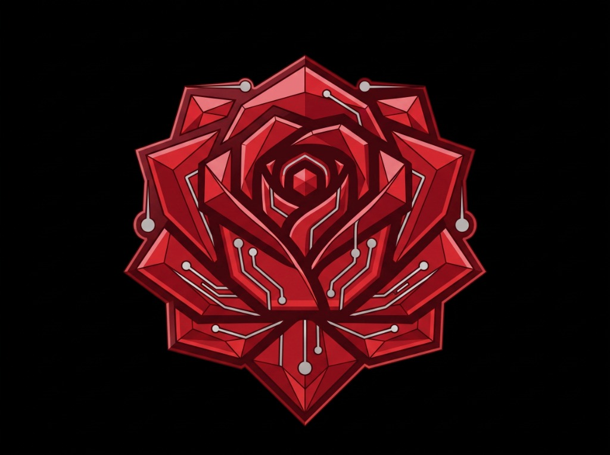

# ⚡ TSOLUTIONS IPIDD — vCard & Review Engine
### *Plataforma de Identidad Digital Interactiva, NFC & Google Cloud SQL*



---

## 📖 1. Descripción General del Proyecto

**TSOLUTIONS IPIDD vCard Engine** es una solución tecnológica integral de identidad digital diseñada para sustituir las tarjetas de presentación tradicionales de papel por una **experiencia interactiva de alto impacto**. 

La plataforma permite a profesionales, directivos y empresas diseñar en tiempo real su tarjeta digital personalizada, desplegarla en servidores de alta disponibilidad en **Google Cloud SQL** y programar chips NFC (tarjetas físicas o stickers para smartphone) y códigos QR vectoriales de alta resolución.

### 🌟 Características Principales
* 🎨 **3 Temas Estructurales:** *Cyber Modern / Dark*, *Clásico Corporativo* y *Minimalista Ejecutivo*.
* 🎛️ **Doble Selector Tipográfico Google Fonts:** Tipografía Primaria (Nombre y Botón de Acción) y Tipografía Secundaria (Cuerpo y Contacto).
* 🖼️ **Sliders de Encuadre de Banner:** Control de Desplazamiento Vertical (0% a 100%) y Zoom (1.0x a 2.5x).
* 📍 **Vinculación Inteligente a Google Maps:** Búsqueda automática por empresa, dirección o ciudad para negocios físicos u online.
* 🌐 **Prefijos Precargados de Redes Sociales:** Integración limpia para Facebook, Instagram, LinkedIn y video de presentación en YouTube.
* 💾 **Generador de Entregables 1-Click:** Archivo vCard 3.0 (`.vcf`), Código QR en HD (`.png`), Paquete Integral (`.zip`) y Carta Ejecutiva de Entrega.
* 🛡️ **Panel Administrativo Centralizado (`/admin`):** Con autenticación exclusiva para cuentas `@tsolutionsipidd.com`, búsqueda universal por etiquetas/tags, visualización jerárquica por Empresa (Fila 1), edición total y control de estados.

---

## 📋 2. Preparativos Previos: Checklist de Materiales

Para armar tu tarjeta digital y aprovechar al máximo la experiencia visual y funcional, asegúrate de tener listos los siguientes elementos antes de iniciar:

### 🖼️ A. Activos Visuales (Imágenes)
1. **Logotipo Oficial de la Empresa:**
   * **Formato obligatorio:** **`PNG` con fondo transparente**.
   * **Resolución recomendada:** Mínimo `500 x 500 px` (cuadrado o circular).
   * *Tip:* Un logo sin fondo permite que el aura luminosa (*glow*) y los marcos geométricos de la tarjeta se adapten a tu paleta de colores.
2. **Foto de Portada / Banner:**
   * **Formato:** `JPG`, `PNG` o `WEBP`.
   * **Proporción:** Horizontal / Panorámica (ej. `1200 x 600 px` o `1920 x 1080 px`).
   * *Tip:* Puedes usar una fotografía de tu oficina, equipo de trabajo, textura corporativa o gráfico publicitario. Podrás re-encuadrarla con los sliders en vivo.

### 📝 B. Información de Contacto & Redes
* **Nombre y Apellido completo.**
* **Puesto o Cargo:** (Ej. *Director General, Consultor Senior, Especialista en Ventas*).
* **Empresa:** Nombre oficial de tu negocio.
* **Teléfono directo y WhatsApp:** Con código de país (Ej. `+52 686 000 0000`).
* **Correo electrónico y Sitio Web oficial.**
* **Usuarios de Redes Sociales:** Solo necesitas el nombre de usuario (Ej. en Instagram: `tu_empresa`, en LinkedIn: `tu-perfil`).
* **Enlace a Video de YouTube (Opcional):** Link a tu pitch de ventas o video institucional.
* **Dirección o Ciudad:** Para generar tu mapa guiado en Google Maps.
* **Propuesta de Valor / Bio:** Frase corta de 2 a 3 líneas que resuma lo que resuelves para tus clientes.

### 🎨 C. Paleta de Colores de Marca (Códigos HEX)
Ten a la mano los colores de tu identidad:
* **Color 1 (Primario):** Títulos, Puesto y marcos principales.
* **Color 2 (Secundario):** Franjas de acento, íconos de contacto y badges.
* **Color 3 (CTA):** Botón principal de *"Guardar Contacto en Mi Celular"*.

---

## 🛠️ 3. Instructivo de Construcción Paso a Paso

Sigue estos 5 pasos dentro de la plataforma (`http://localhost:3000` o `https://vc.tsolutionsipidd.com`):

```
[ PASO 1: Subir Logo & Banner ] ──► [ PASO 2: Datos de Contacto ] ──► [ PASO 3: Branding & Tipografía ]
                                                                                   │
[ PASO 5: Descargar Entregables ] ◄── [ PASO 4: Desplegar en Google Cloud ] ◄─────┘
```

### Paso 1: Subida de Imágenes y Ajuste de Encuadre
1. En el panel izquierdo, haz clic en **"Logotipo de la Empresa"** y selecciona tu archivo PNG transparente.
2. Haz clic en **"Foto de Portada / Banner"** para subir tu imagen horizontal.
3. Utiliza el **Slider de Desplazamiento Vertical** (Arriba/Abajo) y el **Slider de Zoom** para encuadrar la parte más atractiva de tu foto dentro del teléfono.
4. Ajusta la **Escala del Logo** (de 50px a 160px) según la prominencia deseada.

### Paso 2: Llenado de Datos y Redes Sociales
1. Escribe tu **Nombre, Apellido, Empresa y Puesto**.
2. Ingresa tu **Teléfono, WhatsApp y Correo**.
3. En la sección de **Redes Sociales**, escribe únicamente tu usuario (los prefijos `facebook.com/`, `instagram.com/` y `linkedin.com/in/` ya vienen configurados).
4. Escribe tu **Dirección** o simplemente tu **Ciudad** para que Google Maps se vincule automáticamente.
5. Redacta tu **Nota o Bio Ejecutiva**.

### Paso 3: Selección de Tema, Tipografías y Colores
1. Elige uno de los 3 **Temas Estructurales**:
   * **Cyber Modern / Dark:** Fondo oscuro midnight con aura de neón.
   * **Clásico Corporativo:** Cabecera vibrante con logo centrado en marco blanco elevado.
   * **Minimalista Ejecutivo:** Diseño editorial centrado con marco geométrico.
2. Selecciona la **Tipografía Primaria** (para tu Nombre y Botón de Acción) y la **Tipografía Secundaria** (para el resto del texto).
3. Selecciona tus **3 Colores de Marca** con el selector visual o escribiendo tu código hexadecimal (ej. `#F97316`).

### Paso 4: Despliegue en Google Cloud SQL
1. Revisa la vista previa en tiempo real en la pantalla del celular a la derecha.
2. Haz clic en el botón naranja:
   👉 **`🚀 GUARDAR Y DESPLEGAR PERFIL (GOOGLE CLOUD)`**
3. El sistema almacenará tu perfil en la base de datos y te entregará tu **enlace permanente único** (Ej. `https://vc.tsolutionsipidd.com/p/javier-gallardo-tsolutions-a3b1c`).

### Paso 5: Descarga de Entregables
1. **Código QR HD (.PNG):** Haz clic en `⬇ Descargar QR (.PNG)` para obtener tu código en resolución ultra-alta (1200x1200px) listo para imprimir o enviar.
2. **Archivo de Contacto (.VCF):** Haz clic en `💾 Descargar .VCF Individual` para guardar tu tarjeta digital.
3. **Paquete Completo (.ZIP):** Haz clic en `📦 DESCARGAR PAQUETE COMPLETO (.ZIP)` para descargar en 1 solo clic tu QR, tu VCF y tu archivo de instrucciones.
4. **Carta Oficial de Entrega:** Haz clic en `✉️ Enviar Entregables por Correo` o `📋 Ver Carta de Entrega Oficial` para notificar al cliente final.

---

## 📲 4. Cómo Programar tu Tarjeta o Sticker NFC

Una vez que tengas tu enlace permanente desplegado, grabarlo en un chip físico toma **3 segundos**:

1. Descarga la aplicación gratuita **NFC Tools** (disponible en [App Store para iPhone](https://apps.apple.com/app/nfc-tools/id1252962749) y [Google Play para Android](https://play.google.com/store/apps/details?id=com.wakdev.wdnfc)).
2. Abre la app y entra a la pestaña **`Escribir`** -> **`Añadir un registro`** -> **`URL / Enlace`**.
3. Pega el enlace de tu tarjeta digital (Ej. `https://vc.tsolutionsipidd.com/p/tu-slug`).
4. Pulsa en **`Escribir / [Bytes]`** y acerca tu tarjeta física o sticker NFC a la parte superior trasera de tu celular.
5. ¡Listo! Al acercar la tarjeta a cualquier smartphone moderno (iPhone o Android), tu tarjeta digital se abrirá automáticamente sin necesidad de que la otra persona tenga apps instaladas.

---

## 🛡️ 5. Panel Administrativo Centralizado (`/admin`)

Diseñado para que el equipo de **TSOLUTIONS IPIDD** o el departamento de Recursos Humanos de una empresa controle todas sus tarjetas:

* **Acceso Exclusivo:** Registro de administradores restringido únicamente a correos corporativos `@tsolutionsipidd.com`.
* **Fila 1 por Empresa:** Cada registro destaca en grande el nombre de la empresa cliente para auditorías rápidas.
* **Buscador Universal & Tags:** Filtra al instante por `#VIP`, `#Ventas`, `#Directivo`, `#Mexicali`, nombre, teléfono o slug.
* **Edición Completa:** Modifica el 100% de los campos de cualquier perfil existente.
* **Validación en 1 Toque:** Cambia estados entre *Activo*, *Validado*, *Pendiente* y *Archivado*.
* **Reenvío de Entregables:** Descarga directa de `.ZIP` y reenvío de la carta oficial de entrega.

---

## 💻 6. Arquitectura Técnica & Despliegue

### Stack Tecnológico
* **Framework:** Next.js 16 (App Router + Turbopack).
* **Frontend:** React 19, Tailwind CSS 4, Google Fonts API.
* **Base de Datos:** PostgreSQL en **Google Cloud SQL** (con pool de conexiones `pg` y SSL optimizado).
* **Empaquetado:** `JSZip` para compilación de bundles en cliente.
* **Códigos QR:** `qrcode.react` con renderizado vectorial SVG a Canvas PNG en alta resolución.
* **Seguridad:** Cifrado criptográfico PBKDF2 (`SHA-512`) y Cookies de sesión HTTP-Only seguras.

### Variables de Entorno (`.env`)
```env
DATABASE_URL="postgresql://usuario:contraseña@IP_GOOGLE_CLOUD_SQL:5432/vcard_db?sslmode=require"
AUTH_SECRET="tu-clave-secreta-de-autenticacion-tsolutions-2026"
```

### Comandos de Ejecución
```bash
# Instalar dependencias
npm install

# Iniciar servidor de desarrollo local
npm run dev

# Compilar para producción
npm run build

# Iniciar en producción
npm start
```

---

## 🏢 Créditos & Marca

Desarrollado con estándares de ingeniería de alto rendimiento por:

**TSOLUTIONS IPIDD**  
*Soluciones Digitales, Transformación Operativa & Consultoría Tecnológica*  
🌐 [https://tsolutionsipidd.com](https://tsolutionsipidd.com)  
✉️ contacto@tsolutionsipidd.com  
📍 Mexicali, Baja California, México
